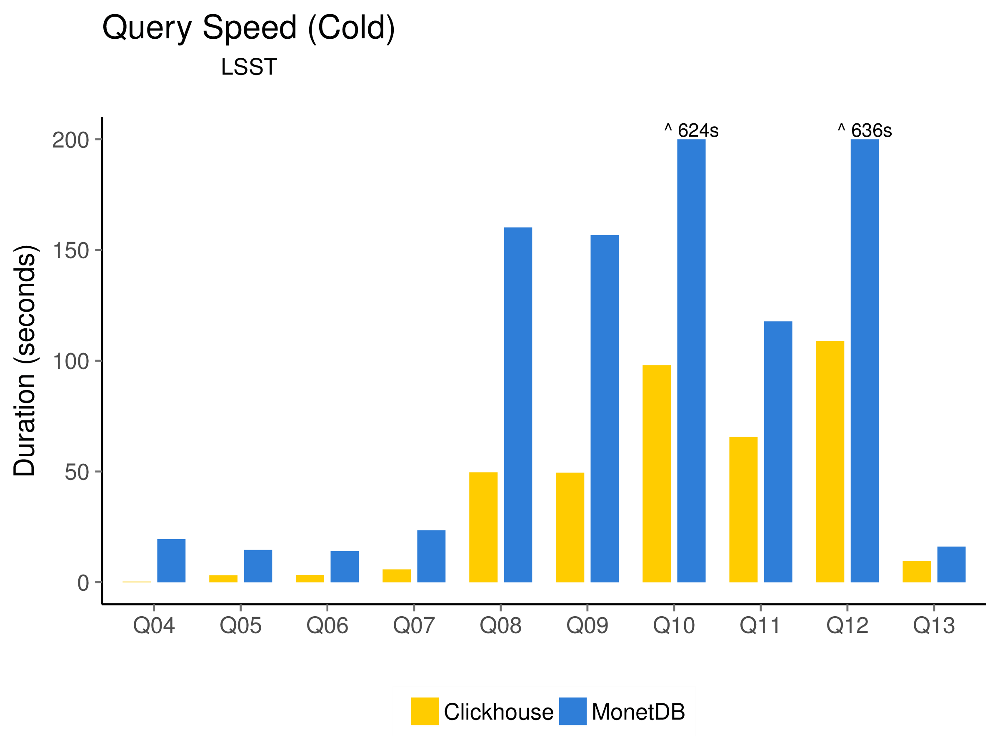
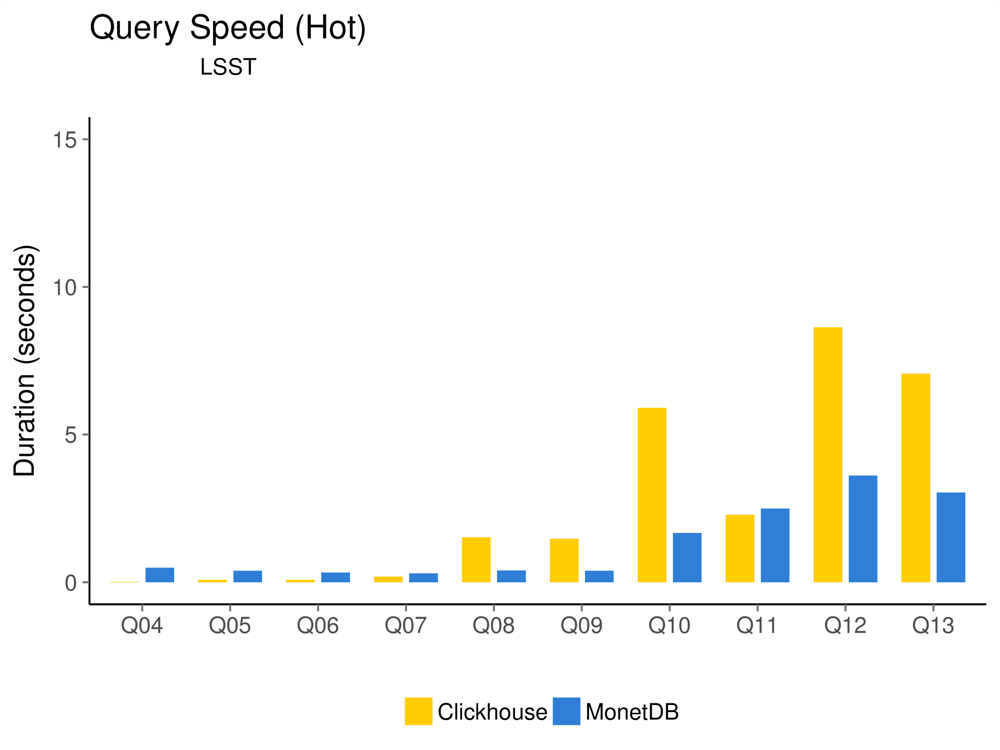

# Running LSST on ClickHouse

A [recent blog post](https://www.monetdb.org/blog/lsst-in-monetdb
) presented experiments with (synthetic) data as expected from the [Large Synoptic Survey Telescope (LSST)](https://www.lsst.org/about). Here, we describe a repetition of those experiments with [ClickHouse](https://clickhouse.yandex), an analytical DBMS developed by Yandex and released as Open Source. 

 Fabrice Jammes and his team from LSST-France kindly provided us with 2 TB of artificial LSST CSV files. The files (550GB compressed) are [available for download](https://sisyphus.project.cwi.nl/.lsst/). The dataset consists of four main tables, each partitioned to cover a specific area of the sky. The data is structured into the following tables:
 - `Source`: 1.465.686.816 rows, 87 columns
 - `ForcedSource`: 7.194.676.239 rows, 13 columns
 - `Object`: 79.226.537 rows, 236 columns
 - `ObjectFullOverlap`: 32.485.682 rows, 236 columns

To load this data, we have created a schema definition for ClickHouse using the [`MergeTree` table engine](https://clickhouse.yandex/docs/en/table_engines/mergetree.html). For details, see the schema definition [in this repository](results-2018-01-03/LSST-clickhouse-schema-mergetree.sql). We used a parallel load from the command line:

````
ls *.csv.xz | xargs -n 1 -P 8 -I % sh -c 'T=`basename % .csv.xz`; echo $T; xzcat % | sed -e "s/;/,/g" -e 's/NULL//g' | clickhouse client --query "INSERT INTO $T FORMAT CSVWithNames"'
````

After loading, we ran the same 13 benchmark queries as before, after some adaptation to ClickHouse. The main difference is in Q13, which uses a selfjoin with range predicates to find overlapping sources. The queries as used are also [in this repository](LSST-clickhouse-queries.sql).

Queries were run in two different modes: Cold and Hot mode. In cold mode, all OS file caches are cleared, the dabase is started, and the query run. The database is shut down again and the process repeats. In Hot mode, the database is not shut down, and queries are run twice before timing to warm up various caches. All queries were repeated five times and the results averaged. The used hardware was a rather beefy server with 256 GB of RAM and a Intel Xeon E5-2650 CPU. Clickhouse was compiled from source, [revision `0d3c4f4`](https://github.com/yandex/ClickHouse/commit/0d3c4f4).




We can see that ClickHouse performs well in comparision to MonetDB in the cold runs, most likely due to the use of column compression for on-disk data. MonetDB uses no such compression, which increases the amount of data that needs to be read. For hot runs, MonetDB is faster, which is probably due to the data being in memory uncompressed, and thus not requiring complex access functions for query processing.
